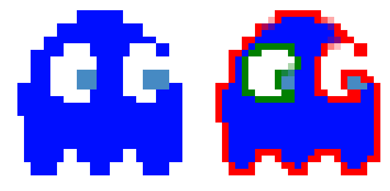

# Contrek
Contrek is a Ruby gem powered by a <u>standalone C++17 core library</u> for fast contour tracing and edge detection in PNG images. It employs a **topological approach** to extract polygonal contours, representing shapes as a connected graph of shared endpoints. This ensures perfect adjacency and structural integrity for shape analysis and raster-to-vector workflows, such as PNG to SVG conversion, managed via libspng (0.7.4) with multithreading support.

## About Contrek library
Contrek (**con**tour **trek**king) simply scans your png bitmap and returns shape contour as close polygonal lines, both for the external and internal sides. It can compute the nesting level of the polygons found with a tree structure. It supports various levels and modes of compression and approximation of the found coordinates. It is capable of multithreaded processing, splitting the image into vertical strips and recombining the coordinates in pairs.

In the following image all the non-white pixels have been examined and the result is the red polygon for the outer contour and the green one for the inner one


## Install

Add this line to your application's Gemfile:

```ruby
gem 'contrek'
```

And then execute:

    bundle install

This will install the gem and compile the native extensions.

## Usage
In this example we are asking to examine any pixel that does not have the red color.

```ruby
result = Contrek.contour!(
  png_file_path: "labyrinth3.png",
  options: {
    class: "value_not_matcher",
    color: {r: 255, g: 0, b: 0, a: 255},
    finder: {treemap: true}
  }
)
```
The resulting metadata information contains the execution times (microseconds), the count of polygons found and the nesting tree map. You can access polygons coordinates too (see later).

```ruby
{:benchmarks=>{"build_tangs_sequence"=>0.129, "compress"=>0.037, "plot"=>0.198, "scan"=>0.114, "total"=>0.478}, :groups=>2, :named_sequence=>"", :treemap=>[]}

```

By default the C++ version is used. If you want run pure but slower ruby implementation
```ruby
result = Contrek.contour!(
  png_file_path: "labyrinth3.png",
  options: {
    native: false, # force ruby pure
    class: "value_not_matcher",
    color: {r: 241, g: 156, b: 156, a: 255}
  }

```

You can bypass the helper and access low level (here the CPP classes)

```ruby
png_bitmap = CPPPngBitMap.new("labyrinth3.png")
rgb_matcher = CPPRGBNotMatcher.new(png_bitmap.rgb_value_at(0, 0))
polygonfinder = CPPPolygonFinder.new(png_bitmap,
  rgb_matcher,
  nil,
  {versus: :a, compress: {visvalingam: {tolerance: 1.5}}})
result = polygonfinder.process_info
# draws the polygons found
Contrek::Bitmaps::Painting.direct_draw_polygons(result.points, png_image)
png_image.save('result.png') # => inspect the image to feedback the result
```

You can also read base64 png images
```ruby
png_bitmap = CPPRemotePngBitMap.new("iVBORw0KGgoAAAANSUhEUgAAAAEAAAABCAYAAAAfFcSJAAAADUlEQVR42mNk+P+/HgAFhAJ/wlseKgAAAABJRU5ErkJggg==")
```

Multithreaded contour processing is supported. However, on Ruby MRI (the standard Ruby implementation, at least up to 3.x), the Global Interpreter Lock (GIL) prevents more than one thread from executing Ruby code simultaneously. As a consequence, execution remains effectively serialized even on multicore systems, unless the gem is used under JRuby or TruffleRuby (not tested).

```ruby
result = Contrek.contour!(
  png_file_path: "./spec/files/images/rectangle_8x8.png",
  options: {
    number_of_threads: 2,
    native: false,
    class: "value_not_matcher",
    color: {r: 255, g: 255, b: 255, a: 255},
    finder: {number_of_tiles: 2, compress: {uniq: true, linear: true}}
  }
)
```
The example uses 2 threads, and the image has been divided into 2 vertical bands. It is also possible to rely on the system to determine the maximum number of threads supported by your CPU (cores) by passing the appropriate parameter.

```ruby
  number_of_threads: nil
```

Regarding multithreading:

- The algorithm splits the contour-detection workflow into multiple phases that can be executed in parallel. The initial contour extraction on each band and the subsequent merging of coordinates between adjacent bands—performed pairwise, recursively, and in a non-deterministic order—results in a final output that is not idempotent. Idempotence is guaranteed only when the exact same merging sequence is repeated.

- The treemap option is currently ignored (multithreaded treemap support will be introduced in upcoming revisions).

By not declaring native option CPP Multithreading optimized code is used. In the above example a [105 MP image](spec/files/images/sample_10240x10240.png) is examined by 2 threads working on 2 tiles (total compute time about 1.66 secs with image load).

```ruby
result = Contrek.contour!(
  png_file_path: "./spec/files/images/sample_10240x10240.png",
  options: {
    number_of_threads: 2,
    class: "value_not_matcher",
    color: {r: 255, g: 255, b: 255, a: 255},
    finder: {number_of_tiles: 2, compress: {uniq: true}}
  }
)
puts result.metadata[:benchmarks].inspect

{ "compress"=>13.423765,
  "init"=>612.654121,
  "inner"=>14.8930669,
  "outer"=>33.0693249,
  "total"=>626.0778879
}

```

## Result

The result structure contains polygon coordinates and a set of metadata. Polygon coordinates can be accessed via:

```ruby
result.polygons

[{:outer=>[11, 2, 11, 5, 6, 5, 6, 2],
  :inner=>[[10, 3, 7, 3, 7, 4, 10, 4]]}]
```

For native classes (C/C++), coordinates are represented as an interleaved NumPy array (`ndarray`) in the form:

```
[x0, y0, x1, y1, ...]
```

A ruby side helper method could converts this data structure into point-based representations:

```ruby
result.points

[{:outer=>[{:x=>11, :y=>2}, {:x=>11, :y=>5}, {:x=>6, :y=>5}, {:x=>6, :y=>2}],
  :inner=>[[{:x=>10, :y=>3}, {:x=>7, :y=>3}, {:x=>7, :y=>4}, {:x=>10, :y=>4}]]}]
```

- `outer` represents a single polygonal sequence  
- `inner` is represented as an array of polygonal sequences (holes)

For pure Ruby implementations (`{ native: false }`), coordinates are always expressed as points.  
In this case, both `polygons` and `points` return the same data, represented as hashes with `x` and `y` keys.

## Metadata

Metadata associated with the result can be accessed via:

```ruby
result.metadata

{:benchmarks=>{"build_tangs_sequence"=>0.00577,
               "compress"=>0.01239,
               "plot"=>0.01919,
               "scan"=>0.01473,
               "total"=>0.05208},
 :groups=>1,
 :named_sequence=>"AFEDCBA",
 :treemap=>[]}
```

## Treemap

The treemap is a data structure that represents the containment hierarchy of polygons. For each polygon, it defines the parent polygon in which it is contained and its relative position among siblings. This structure allows reconstruction of the inclusion tree and determination of nesting relationships between geometries. Consider the above image

```ruby
 "AAAAAAAAAAAAAAAAAAAAAA" \
 "A                    A" \
 "A BBBBBBBBBBBBBBBBBB A" \
 "A BBBBBBBBBBBBBBBBBB A" \
 "A BBB    BBBBB   BBB A" \
 "A BBB CC BBBBB D BBB A" \
 "A BBB    BBBBB   BBB A" \
 "A BBBBBBBBBBBBBBBBBB A" \
 "A BBBBBBBBBBBBBBBBBB A" \
 "A                    A" \
 "AAAAAAAAAAAAAAAAAAAAAA"
```

```ruby
result.metadata[:treemap]

[[-1, -1],  # A
 [0, 0],    # B
 [1, 0],    # C
 [1, 1]]    # D
```

There are four polygons (`A`, `B`, `C`, and `D`).  
The order matches the one provided in `result.polygons`.

Each entry has the structure:

```
[parent_index, position]
```

- Polygon **A** (index `0`) has no parent and is represented as `[-1, -1]`
- Polygon **B** is contained in **A** and is its first child → `[0, 0]`
- Polygon **C** is contained in **B** and is its first child → `[1, 0]`
- Polygon **D** is also contained in **B** and is its second child → `[1, 1]`

## Multithreaded approach

The multithreaded contour-tracing implementation operates as follows:

The input image is divided into multiple vertical bands—at least two—where each band shares a one-pixel-wide vertical strip with its adjacent bands.
For example, if the image is 20 pixels wide and split into two bands, the first band may span from x=0 to x=9 (10 pixels), and the second from x=9 to x=19 (11 pixels).
The vertical column at x=9 is therefore the shared region.

```md
01234567890123456789
---------*----------
```

Each band is processed independently as if it were a standalone image, with its contour-tracing assigned to a dedicated thread.
Whenever two adjacent bands have completed processing, they are assigned to an available thread that performs the merge of their coordinates.

For example, with three bands
B1 – B2 – B3
the merging sequence might be:

B1 + B2 → (B1+B2) + B3
or

B2 + B3 → B1 + (B2+B3)

The order is therefore nondeterministic, constrained only by the possible combinations derived from the initial number of bands.

The merging algorithm operates by splitting polygons that intersect the shared band into sequential subsets of coordinates—called parts—distinguishing between segments inside the shared region and those outside it.
The first stage merges the outer boundary; the second stage merges the disconnected inner parts, which are inserted where needed into the outer sequences produced in the first stage.

This process is applied recursively, merging bands until a single final band remains, upon which the coordinate-compression algorithms are executed.

## Performances native vs pure
One of the most complex test you can find under the spec folder is named "scans poly 1200x800", scans this [image](spec/files/images/sample_1200x800.png) computing coordinates to draw polygons drawn in this [result](spec/files/stored_samples/sample_1200x800.png).
On pure ruby implementation kept time
```ruby
{ :scan=>801.494,
  :build_tangs_sequence=>160.491,
  :plot=>86.633,
  :compress=>0.002,
  :total=>1048.62}
```
This the one for the native C++
```ruby
{ scan: 7.1146329999999995,
  build_tangs_sequence: 3.063812,
  plot: 4.474851999999999,
  compress: 0.0031999999999999997
  total: 14.656496999999998
}
```

About 75x faster. Times are in microseconds; system: AMD Ryzen 7 3700X 8-Core Processor (BogoMIPS: 7199,99) on Ubuntu distro.

## 🛠 C++ Standalone Library Usage

The core of **Contrek** is a high-performance `C++17` library. It is designed to be **standalone**, meaning it has zero dependencies on Ruby and can be integrated into any `C++` project.


### Prerequisites
* **CMake** (3.10+)
* **ZLIB** (Required for PNG processing)
* **C++17 Compiler**

### 1. Build & Run Examples
If you want to test the performances or see the library in action:

```bash
# Navigate to the core folder
cd ext/cpp_polygon_finder/PolygonFinder

# Setup build directory
mkdir build && cd build

# Configure with examples enabled
cmake -DBUILD_EXAMPLES=ON ..

# Build and run
make
./contrek_test
```

### 2. How to integrate it into your project

To use Contrek's engine in your own C++ application without Ruby:

1. **Copy the core folder**: Take the `ext/cpp_polygon_finder/PolygonFinder` directory and place it inside your project (e.g., in a `libs/` or `third_party/` folder).
2. **Update your CMakeLists.txt**: Add these lines to link the library:

```cmake
# Tell CMake to include Contrek
add_subdirectory(libs/PolygonFinder)

# Link it to your executable
add_executable(my_app main.cpp)
target_link_libraries(my_app PRIVATE ContrekLib)
```

### 3. C++ API Quick Start

Contrek provides a high-level C++ API. Here is how you can use it in your standalone projects:

```cpp
#include "ContrekApi.h"
#include <iostream>

int main() {
    // 1. Configure the engine
    Contrek::Config cfg;
    cfg.threads = 4;
    cfg.tiles = 2;

    // 2. Run the tracing process
    // Supports PNG files via internal spng integration
    auto result = Contrek::trace("path/to/image.png", cfg);

    // 3. Access results
    result->print_info(); // prints generic infos
    std::cout << "Found polygons: " << result->groups << std::endl;

    return 0;
}
```

## License

This project is licensed under the terms of the MIT license.

See [LICENSE.md](LICENSE.md).

## Changelog

See [CHANGELOG.md](CHANGELOG.md) for a complete list of changes.

## History
The algorithm was originally developed by me in 2018 when I was commissioned to create a Rails web application whose main objective was to census buildings from GoogleMAPS; the end user had to be able to select their home building by clicking its roof on the map which had to be identified as a clickable polygon. The solution was to configure GoogleMAPS to render buildings of a well-defined color (red), and at each refresh of the same to transform the div into an image (html2canvas) then process it server side returning the polygons to be superimposed again on the map. This required very fast polygons determination. Searching for a library for tracing the contours I was not able to find anything better except OpenCV which however seemed to me a very heavy dependency. So I decided to write my algorithm directly in the context of the ROR application. Once perfected, it was already usable but a bit slow in the higher image resolutions. So I decided to write the counterpart in C++, which came out much faster and which I then used as an extension on Ruby by means of Rice.

I thought that the algorithm had excellent qualities but I never had the time to develop it further. A few months ago I decided to publish it as a gem, freely usable. The gem includes the C++ extension. There is also a [Rails 7.1 demo project](https://github.com/runout77/contrek_rails) that uses the gem and proposes the same scheme I described above. Starting from a GoogleMAPS map, the server receives the image and returns the outlines to be drawn again on the same. It is a great way to test an applicative use of this gem. Enjoy!.