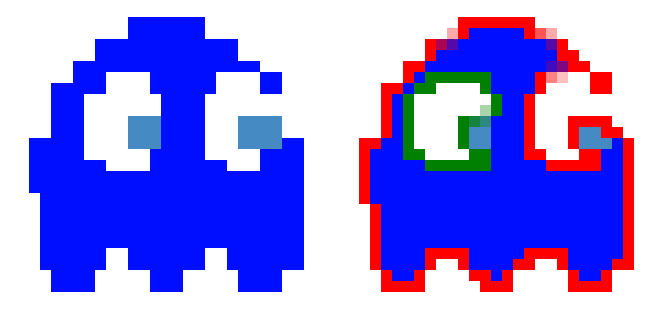
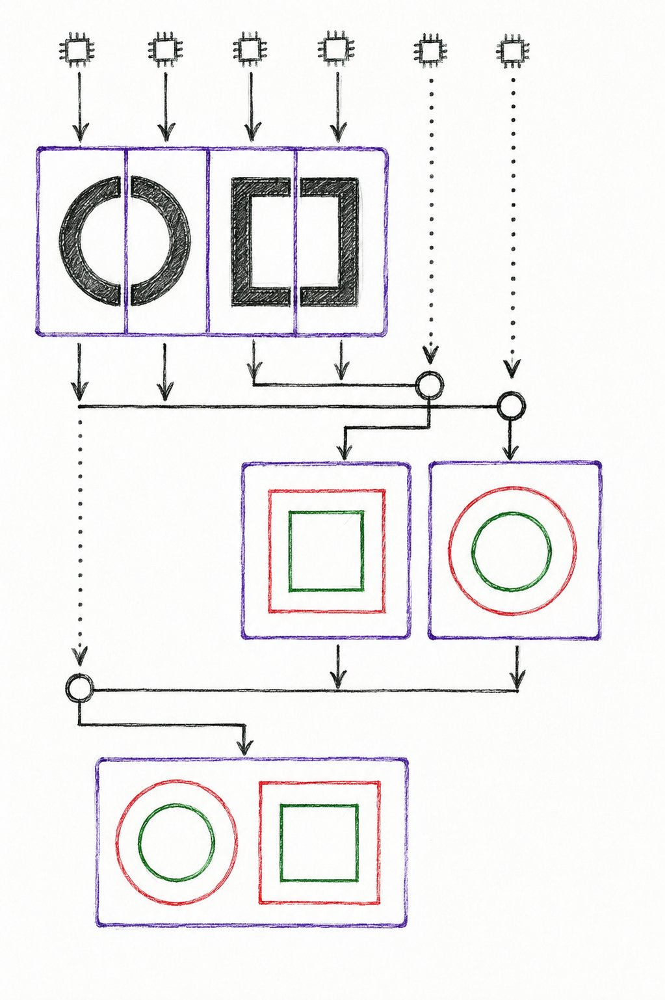
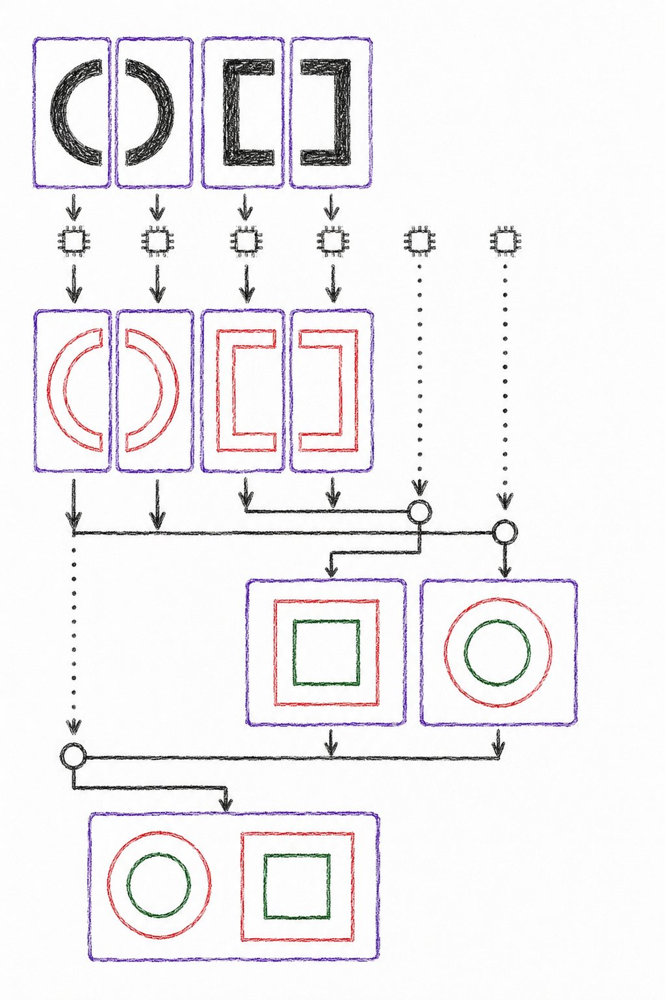
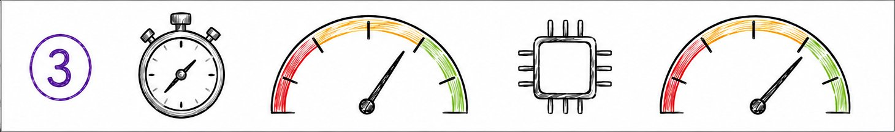
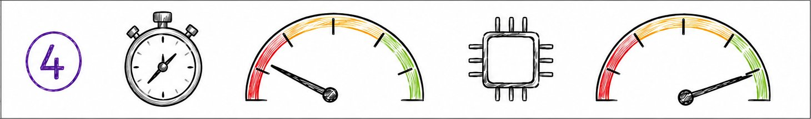

# Contrek

**Contrek** is a standalone **C++17 contour tracing and polygonization library** for raster images.

It was originally developed to solve a practical problem: extracting polygons from very large raster images without loading the entire image into memory. Over time the implementation evolved into a reusable library that can process PNG and TIFF/GeoTIFF images as well as raw memory buffers, while preserving polygon topology during the entire tracing process.

The engine is based on programmable pixel matchers, allowing the caller to decide which pixels belong to the regions being traced. Polygon coordinates can be streamed as they are produced, making the library suitable for datasets that would otherwise require a large amount of RAM. GeoTIFF geolocation can also be preserved when streaming directly to GeoJSON (EPSG:4326).

Although the tracing engine is written in C++, Contrek is also distributed as a Ruby gem exposing almost the complete native API through an idiomatic Ruby interface.

A **Python** binding is available 👉 **[here](https://github.com/runout77/contrek-python)**

## About Contrek

**Contrek** (**CON**tour **TREK**king) at its simplest, the library scans a bitmap and returns the contours of all regions matching a user-defined criterion. Each region is represented by one outer polygon and, when necessary, one or more inner polygons describing holes.

Besides extracting contours, Contrek can also determine the nesting relationship between polygons and build a tree describing which polygons contain others. This is useful when reconstructing the topology of complex shapes.

Several coordinate-compression algorithms are available to reduce polygon size after tracing. The library can also split the work across multiple threads by processing independent vertical stripes and merging the results afterwards into a single topologically consistent representation.

The image below shows a simple example. Every non-white pixel is considered part of the traced region. The resulting outer contour is shown in red, while inner contours are shown in green.




# Why Contrek?

Most contour tracing libraries process an image sequentially. That approach is perfectly adequate for many workloads, but it becomes less practical once images become very large or when memory usage starts to matter.

Contrek supports monothread extraction but also different strategies.

### Mode 1: Single-threaded processing

<table>
<tr>
<td width="40%" valign="top">

</td>
<td width="60%" valign="top">
The entire image is processed using a single core.

**Profile:** low speed; low memory efficiency.
<br><br>
<center></center>
</td></tr></table>

Trace polygons from a PNG file (`CPPPngBitMap`).

```ruby
  png_bitmap = CPPPngBitMap.new("spec/files/images/labyrinth3.png")
  color = Contrek::Bitmaps::RgbCppColor.new(r: 255, g: 255, b: 255, a: 255)
  rgb_matcher = CPPRGBNotMatcher.new(color.raw)
  polygonfinder = CPPPolygonFinder.new(
    png_bitmap,
    rgb_matcher,
    nil,
    { versus: :a,
      compress: {
        visvalingam: true,
        visvalingam_tolerance: 1.5
      }
    }
  )
  result = polygonfinder.process_info
  puts result.metadata[:number_of_threads] # => 0
```

`versus` accepts `:a`,`:o` for "anticlockwise"/"clockwise".


### Mode 2: Parallel processing

<table>
<tr>
<td width="40%" valign="top">

</td>
<td width="60%" valign="top">
The entire image is loaded first, then split into tiles and processed across multiple CPU cores. Partial results are progressively and dynamically merged: there is no predefined merge order, and adjacent pairs are processed as soon as they become available.
This mode prioritizes performance, using parallelism both for tile processing and for merging partial results.

**Profile:** maximum speed, with processing time decreasing as more cores become available; low memory efficiency.
<br><br>
<center></center>
</td></tr></table>

Use 8 threads and 8 tiles

```ruby
  png_bitmap = CPPPngBitMap.new("spec/files/images/sample_10240x10240.png")
  color = Contrek::Bitmaps::RgbCppColor.new(r: 255, g: 255, b: 255, a: 255)
  rgb_matcher = CPPRGBNotMatcher.new(color.raw)
  polygonfinder = Contrek::Cpp::CPPConcurrentFinder.new(
    number_of_threads: 8,
    bitmap: png_bitmap,
    matcher: rgb_matcher,
    options: {number_of_tiles: 8, versus: :o, compress: {uniq: true}}
  )
  result = polygonfinder.process_info
  puts result.metadata[:benchmarks].inspect
  # => {"compress"=>5.08, "init"=>230.79, "inner"=>6.54, "outer"=>84.11, "total"=>235.87}
  puts result.metadata[:number_of_threads] # => 8
```

### Mode 3: Input streaming

<table>
<tr>
<td width="40%" valign="top">

</td>
<td width="60%" valign="top">
The image does not need to be loaded entirely into memory. Instead, it can be read progressively using a fixed-size buffer. For example, with a PNG source, this can be done using libspng's progressive decoding.
Adjacent tiles share an overlapping scanline to preserve geometry continuity across tile boundaries. Once all tiles have been added, the merge is performed (optionally using multiple threads) to reconstruct the complete geometry.
This mode provides a trade-off between performance and memory usage: the entire raster does not need to be kept in RAM, while the vector state required to build the final result is retained.

**Profile:** medium speed; medium-high memory efficiency.
<br><br>
<center></center>
</td></tr></table>

Trace polygons from two in-memory pattern strings (`CPPBitMap`, useful for synthetic tiles or tests).
Up is 6 rows height, down is 5 rows. Total after merging: 10 rows, because one row is the shared scanline

```ruby
  up =    " 00000000000000               " \
          " 00000000000000               " \
          " 00          00               " \
          " 00          00               " \
          " 00          00               " \
          " 00          00               "

  down =  " 00          00               " \
          " 00          00               " \
          " 00          00               " \
          " 00000000000000               " \
          " 00000000000000               "
  matcher = CPPValueNotMatcher.new(" ")
  result_up = CPPPolygonFinder.new(CPPBitMap.new(up, 30),
    matcher,
    nil,
    {versus: :a, bounds: true}).process_info
  result_down = CPPPolygonFinder.new(CPPBitMap.new(down, 30),
    matcher,
    nil,
    {versus: :a, bounds: true}).process_info

  step_finder = Contrek::Cpp::CPPConcurrentVerticalMerger.new(options: {compress: {linear: true}})
  step_finder.add_tile(result_up)
  step_finder.add_tile(result_down)
  result = step_finder.process_info

  expect(result.metadata[:groups]).to eq(1)
  expect(result.metadata[:width]).to eq(30)
  expect(result.metadata[:height]).to eq(10)
```
See an other example of **[input streaming graphical result](docs/images/stripes/merging_polygons.md)**.

The same operation using Contrek's built-in streaming API and progressive PNG decoding via libspng:

```ruby
  # PNG image to stream from
  source = CPPPngSource.new("./spec/files/images/labyrinth2.png")
  # streamer with a 20-row window
  streamer = CPPRasterStreamer.new(source, stripe_height: 20)
  white = Contrek::Bitmaps::RgbCppColor.new(r: 255, g: 255, b: 255, a: 255)
  matcher = CPPRGBNotMatcher.new(white.raw)
  # reusable bitmap where libspng decodes rows directly
  buffer_bitmap = CPPRawBitMap.new(source.width, streamer.stripe_height)
  finder = Contrek::Cpp::CPPConcurrentVerticalMerger.new(options: {compress: {uniq: true, linear: true}})
  
  # streaming loop, 20 rows each
  streamer.each(buffer_bitmap) do |bitmap, buffer_rows, buffer_size|
    tile = CPPPolygonFinder.new(
      bitmap,
      matcher,
      nil,
      {processing_height: buffer_rows, versus: :o, bounds: true}
    ).process_info
    finder.add_tile(tile)
  end
  result = finder.process_info
  puts result.metadata[:width] # => 130
  puts result.metadata[:height] # => 130
  puts result.points[0][:outer].first.inspect # => {:x=>10, :y=>4} # first point
  puts result.points[0][:outer].size # => 1171 points
```

### Mode 4: End-to-end streaming

<table>
<tr>
<td width="40%" valign="top">

</td>
<td width="60%" valign="top">
This mode extends the incremental processing used in Mode 3 by streaming the output as well.
The image is read and processed one tile at a time. Each new tile is immediately merged with the current state. As processing moves forward, whenever a geometry is complete and can no longer be affected by subsequent tiles, it is finalized and written directly to the SVG file.
This limits both the amount of raster data kept in memory and the accumulation of generated vector geometries. It is particularly well suited to very large datasets or cases where the vector output itself can become significant in size.

**Profile:** low speed; maximum memory efficiency.
<br><br>
<center></center>
</td></tr></table>

Trace polygons from 2 in-memory pattern strings.

```ruby
  stripe1 = "     000       000" \
            "    00 00     00 0" \
            "   00   00   00  0" \
            "    00 00   00   0" \
            "     000   00    0" \
            "          00     0"

  stripe2 = "          00     0" \
            " 000     00      0" \
            "00 00   00       0" \
            " 000   00        0" \
            "      00         0" \
            "     0000000000000"
  # streaming to svg file pattern
  stripes = [stripe1, stripe2]
  shared_stream = Contrek::Cpp::CPPTempfile.new("output.svg")
  step_finder = Contrek::Cpp::CPPSvgConcurrentStreamingMerger.new(
    options:  {bounds: true, compress: {uniq: true, linear: true, douglas_peucker: true}},
    stream_to: shared_stream,
    total_width: 18,
    total_height: 11
  )
  matcher = CPPValueNotMatcher.new(" ")
  stripes.each do |stripe|
    stripe_result = CPPPolygonFinder.new(CPPBitMap.new(stripe, 18),
      matcher,
      nil,
      {versus: :a, bounds: true}).process_info
    last = stripes.last == stripe
    step_finder.add_tile(stripe_result, last)
  end
  result = step_finder.process_info
  expect(result.metadata[:groups]).to eq(3)
  expect(result.metadata[:width]).to eq(18)
  expect(result.metadata[:height]).to eq(11)
  shared_stream.rewind
  puts shared_stream.read.inspect
  # => "<svg xmlns=\"http://www.w3.org/2000/svg\" width=\"18\" height=\"11\">
  #     <polygon points=\"3,3 5,5 8,5 10,3 8,0 5,0\" class=\"out\"/>
  #     <polygon points=\"7,1 8,3 6,4 5,2\" class=\"in\"/>
  #     <polygon points=\"5,11 18,11 18,0 15,0\" class=\"out\"/> ...
```

## Benchmarking

Contrek has been benchmarked mainly against OpenCV, which is probably the most widely used library for contour extraction.

The goal was not simply to compare execution times, but also to verify that the reconstructed polygons remain topologically correct after stripe merging, even when processing very large images.

The benchmark suite measures three aspects:

- execution time;
- memory usage;
- consistency of the generated polygons.

The benchmark source code and the datasets used for testing are available here:

👉 **[test_contrek](https://github.com/runout77/test_contrek)**


## Prerequisites

For small and medium-sized images no special configuration is required.

If you expect to process very large images (roughly 20k pixels or more), installing **tcmalloc** is recommended. It generally provides more stable memory behaviour than the default allocator during long-running processing.

### Ubuntu / Debian

```bash
sudo apt-get install libgoogle-perftools-dev
```

For additional tuning options (zlib-ng, thread configuration, memory allocator and other performance-related settings), see **[PERFORMANCE.md](PERFORMANCE.md)**.

> **Platform support**
>
> Native extensions are currently supported on **Linux** and **macOS**.
>
> Windows is not supported because the implementation relies on POSIX threading primitives and platform-specific memory management. Running under **WSL2** is currently the recommended approach for Windows users.


# Installation

Add the gem to your application's Gemfile:

```ruby
gem "contrek"
```

and install it normally:

```bash
bundle install
```

During installation the native C++ extension is compiled automatically.

Once installed, the C++ implementation is used by default. A pure Ruby implementation is also included and can be selected explicitly whenever native extensions are not desired.

### TIFF / GeoTIFF support

TIFF and GeoTIFF streaming support requires the system `libtiff` and `libgeotiff` libraries.
Ubuntu / Debian:

```bash
sudo apt install libtiff-dev libgeotiff-dev
```

# Usage

The simplest way to use Contrek is through the `Contrek.contour!` helper.

In the example below, every pixel except pure red is considered part of the region to be traced.

```ruby
result = Contrek.contour!(
  png_file_path: "labyrinth3.png",
  options: {
    class: "value_not_matcher",
    color: {r: 255, g: 0, b: 0, a: 255},
    finder: {treemap: true}
  }
)
```

The returned object contains both the extracted polygons and some metadata describing the execution.

Metadata includes timing information (expressed in milliseconds), the number of detected polygon groups and, if requested, the nesting tree.

```ruby
{
  :benchmarks=>{
    "build_tangs_sequence"=>0.129,
    "compress"=>0.037,
    "plot"=>0.198,
    "scan"=>0.114,
    "total"=>0.478
  },
  :groups=>2,
  :named_sequence=>"",
  :treemap=>[],
  :number_of_threads=>0
}
```

The actual polygon coordinates are discussed later in the **Result** section.


## Pure Ruby implementation

By default Contrek uses the native C++ implementation.

A pure Ruby version is included mainly for portability, debugging and environments where compiling native extensions is not possible.

It exposes the same public API, although execution is considerably slower.

```ruby
result = Contrek.contour!(
  png_file_path: "labyrinth3.png",
  options: {
    native: false,
    class: "value_not_matcher",
    color: {r: 241, g: 156, b: 156, a: 255}
  }
)
```

## Performance Native vs Pure

One of the largest examples included in the test suite processes the image `sample_1200x800.png`.

Pure Ruby:

```ruby
{
  scan: 775.435,
  build_tangs_sequence: 38.916,
  plot: 101.876,
  compress: 0.002,
  total: 916.229
}
```

Native C++:

```ruby
{
  scan: 5.077,
  build_tangs_sequence: 0.697,
  plot: 2.004,
  compress: 0.000,
  total: 7.781
}
```

On the reference machine used for development (AMD Ryzen 7 3700X, Ubuntu, 64 GB RAM), the native implementation is roughly 130× faster for this workload.

As always with benchmarks, these numbers should be considered indicative rather than absolute. Actual performance depends on image content, compression settings and hardware.


## Working with the C++ API

The helper method is convenient for most applications, but it is also possible to access the native classes directly.

This gives more control over bitmap creation, matcher selection and polygon finder configuration.

```ruby
png_bitmap = CPPPngBitMap.new("labyrinth3.png")

rgb_matcher = CPPRGBNotMatcher.new(
  png_bitmap.rgb_value_at(0, 0)
)

polygonfinder = CPPPolygonFinder.new(
  png_bitmap,
  rgb_matcher,
  nil,
  {
    versus: :a,
    compress: {
      visvalingam: true,
      visvalingam_tolerance: 1.5
    }
  }
)

result = polygonfinder.process_info

Contrek::Bitmaps::Painting.direct_draw_polygons(
  result.points,
  png_image
)

png_image.save("result.png")
```

Using the low-level API is useful when building custom processing pipelines or when more control over the tracing process is required.


## Reading PNG images from Base64

When image data is already available as a Base64 string there is no need to write it to disk first.

```ruby
png_bitmap = CPPRemotePngBitMap.new(
  "iVBORw0KGgoAAAANSUhEUgAAAAEAAAABCAYAAAAfFcSJAAAADUlEQVR42mNk+P+/HgAFhAJ/wlseKgAAAABJRU5ErkJggg=="
)
```


## Processing raw memory buffers

Contrek is not limited to PNG files.

Images can also be created directly in memory, making the library suitable for integration with image-processing pipelines that never touch the filesystem.

The following example creates a small bitmap, draws a rectangle and extracts its contour.

```ruby
raw_bitmap = CPPRawBitMap.new

raw_bitmap.define(20,30,4,true)

4.upto(5) do |y|
  5.upto(8) do |x|
    raw_bitmap.draw_pixel(x, y, 1, 0, 0, 0)
  end
end

not_matcher = CPPRGBNotMatcher.new(
  raw_bitmap.rgb_value_at(0,0)
)

result = CPPPolygonFinder.new(
  raw_bitmap,
  not_matcher,
  nil,
  {
    compress:{
      uniq:true,
      linear:true
    }
  }
).process_info

puts result.points.inspect
```

which produces

```ruby
[
  {
    :outer=>[
      {x:5,y:4},
      {x:5,y:6},
      {x:9,y:6},
      {x:9,y:4}
    ],
    :inner=>[]
  }
]
```

This interface is particularly useful when image data comes from another application, a network stream or an in-memory processing stage rather than from a PNG file.

# Multithreading

Both the native C++ implementation and the pure Ruby implementation expose the same multithreading interface.

There is, however, an important difference between the two.

The native implementation performs contour extraction in parallel and can take advantage of all available CPU cores.

The pure Ruby implementation, on the other hand, is limited by MRI's Global Interpreter Lock (GIL). Although multiple threads can be created, they do not execute Ruby code simultaneously, so CPU-bound workloads remain effectively sequential.

Alternative runtimes such as JRuby or TruffleRuby do not have this limitation, although they have not been tested with Contrek.

A simple multithreaded example:

```ruby
result = Contrek.contour!(
  png_file_path: "./spec/files/images/rectangle_8x8.png",
  options: {
    number_of_threads: 2,
    native: false,
    class: "value_not_matcher",
    color: {r: 255, g: 255, b: 255, a: 255},
    finder: {
      number_of_tiles: 2,
      compress: {
        uniq: true,
        linear: true
      }
    }
  }
)
```

In this example the image is divided into two vertical stripes and each stripe is assigned to a worker thread.

Instead of specifying the number of threads explicitly, you can also let Contrek choose a suitable value automatically.

```ruby
number_of_threads: nil
```

The native implementation uses the number of available CPU cores reported by the operating system.

## A note about determinism

By default, the merge stage is **non-deterministic** to maximize performance and thread utilization.

Each stripe is processed independently, and adjacent stripes are merged opportunistically as soon as they become available. Depending on thread scheduling, the merge order may differ between runs.

For example, given three stripes:

```
B1   B2   B3
```

one execution may merge them like this:

```
(B1 + B2) + B3
```

while another execution may produce:

```
B1 + (B2 + B3)
```

Both executions generate equivalent polygons, but the order of intermediate merge operations is different so the final coordinate sequence is not guaranteed to be byte-for-byte identical across executions.

If you require byte-for-byte reproducible outputs across different runs, you can enable the **deterministic merge mode** (setting `deterministic: true`).

In deterministic mode, stripes are merged strictly according to a fixed binary reduction tree based on their order and index.

> **Requirement:** Deterministic mode requires an **even number of stripes/tiles** to process correctly.

## Native execution

When the `native` option is omitted, Contrek automatically uses the C++ implementation.

For example, the following configuration processes a 105 MP image using four worker threads and four processing tiles.

```ruby
result = Contrek.contour!(
  png_file_path: "./spec/files/images/sample_10240x10240.png",
  options: {
    number_of_threads: 4,
    class: "value_not_matcher",
    color: {r: 255, g: 255, b: 255, a: 255},
    finder: {
      number_of_tiles: 4,
      compress: {
        uniq: true
      }
    }
  }
)

puts result.metadata[:benchmarks]
```

Example timings:

```ruby
{
  compress: 5.3933,
  init: 322.749,
  inner: 4.795,
  outer: 81.546,
  total: 328.142
}
```

The reported timings include tracing, polygon reconstruction and coordinate compression.

# Tracking model

Contrek works on a cell-based representation. Each pixel is treated as a square with four explicit vertices. During tracing, polygons are built by walking along the edges separating matching and non-matching cells.

This representation makes it easier to preserve topology and simplifies the reconstruction of polygons when different image stripes are merged together.

### Pixel geometry

```text
    (x, y)          Top Edge         (x+1, y)
       O--------------------------------O
       |                                |
       |                                |
 Left  |             PIXEL              | Right
 Edge  |            (x, y)              | Edge
       |                                |
       |                                |
       O--------------------------------O
   (x, y+1)       Bottom Edge      (x+1, y+1)
```


## Connectivity

Neighbouring pixels can be connected using either **4-connectivity** or **8-connectivity**.

With **4-connectivity**, only pixels sharing an edge belong to the same region.

With **8-connectivity**, diagonal neighbours are also considered connected.

| Value | Description |
|------:|-------------|
| `4` | Orthogonal connectivity (default) |
| `8` | Includes diagonal neighbours |

To enable 8-connectivity:

```ruby
result = Contrek.contour!(
  png_file_path: "...",
  options: {
    finder: {
      connectivity: 8
    }
  }
)
```

The choice mainly affects how diagonally touching regions are interpreted.

## Merging External Geometry

Contrek's merger can process polygon data produced by external contour
extractors, provided that the input geometry follows the requirements below.

### The Laws of the Tiles

1. **Adjacent tiles must share an overlap and the endpoints of their exposed segments must coincide.**
   Adjacent tiles must share a single scanline of overlap. Exposed contour
   segments may contain different intermediate coordinates, but their
   corresponding endpoints must coincide, allowing the merger to identify and
   reconnect the geometry across tile boundaries.

2. **Coordinates must describe cell boundaries.**
   A cell is the square area occupied by a pixel in the raster. Coordinates
   must describe the boundaries of these cells, rather than representing a
   pixel by its center or by a single vertex.

3. **Contours must follow cell boundaries.**
   Contour segments supplied to the merger must follow the horizontal and
   vertical edges of the raster cells. Diagonal segments are not allowed in
   the geometry passed to the merger.

4. **Polygon orientation (`versus`) must be consistent across all tiles.**
   All polygons must follow the orientation declared by the result, either
   clockwise or counterclockwise. The same orientation must be used by every
   tile submitted to the merger.

5. **Every contour must start at the canonical point of its first scanline.**
   A *scanline* is a horizontal raster row scanned from left to right, like
   the electron beam of a CRT display. Consider the topmost scanline
   intersecting the contour. On that scanline, a **counterclockwise** contour
   must start from the **leftmost** point, while a **clockwise** contour must
   start from the **rightmost** point.

6. **The bounding box must match the contour geometry.**
   `min_x`, `max_x`, `min_y`, and `max_y` must correctly describe the spatial
   extent of the contour.

7. **Tile metadata must match the supplied geometry.**
   `width`, `height`, and `versus` must correctly describe the tile. In
   particular, `height` must represent the actual height of the result.

8. **Polygons must be sorted in raster scan order.**
   Polygons must be ordered by increasing **Y**, and then by increasing **X**
   when they have the same Y: top to bottom, and left to right at the same
   vertical position.

# Results

The tracing result contains two kinds of information:

- the extracted polygons;
- metadata describing how they were produced.

Polygon coordinates are available through

```ruby
result.polygons
```

The native implementation stores coordinates as an interleaved array

```text
[x0, y0, x1, y1, ...]
```

This representation is compact and avoids allocating thousands of small point objects.

If you prefer a more Ruby-friendly representation you can use

```ruby
result.points
```

which converts the same data into hashes containing `x` and `y`.

```ruby
[
  {
    outer: [
      {x:11,y:2},
      {x:11,y:5},
      {x:6,y:5},
      {x:6,y:2}
    ],
    inner: [
      [
        {x:10,y:3},
        {x:7,y:3},
        {x:7,y:4},
        {x:10,y:4}
      ]
    ]
  }
]
```

The conversion is performed only on the Ruby side. Internally, the native implementation continues to use the compact coordinate array.

For pure Ruby (`native: false`) both methods return the same point-based representation.


## Bounding boxes

If bounding boxes are required they can be generated during tracing instead of computing them afterwards.

Enable them with

```ruby
{
  bounds: true
}
```

Each polygon will then include an additional `bounds` entry.

```ruby
{
  bounds:{
    min_x:3,
    max_x:11,
    min_y:1,
    max_y:3
  },
  outer:[...],
  inner:[...]
}
```

Since bounds are computed while polygons are being built, requesting them has almost no additional cost.


# Metadata

Execution metadata is available through

```ruby
result.metadata
```

Typical information includes

- execution times;
- tracing options;
- number of polygon groups;
- nesting information.

```ruby
{
  benchmarks:{...},
  groups:1,
  treemap:[],
  options:{...},
  number_of_threads: 4
}
```

The content of `options` is simply the configuration originally passed to the tracing engine.


# Treemap

Besides returning polygon coordinates, Contrek can also describe how polygons are nested inside one another.

This information is stored in the **treemap**, which records the parent-child relationship between every detected polygon.

Rather than rebuilding the hierarchy afterwards through geometric containment tests, the information is collected during tracing, making it immediately available once processing completes.

Each entry in the treemap refers to the corresponding polygon returned by `result.polygons`.

For example consider the above image traced clockwise (o). 

```ruby
 "AAAAAAAAAAAAAAAAAAAAAA" \
 "A                    A" \
 "A BBBBBBBBBBBBBBBBBB A" \
 "A BBBBBBBBBBBBBBBBBB A" \
 "A BBB    BBBBB   BBB A" \
 "A BBB CC BBBBB D BBB A" \
 "A BBB    BBBBB   BBB A" \
 "A BBBBBBBBBBBBBBBBBB A" \
 "A BBBBBBBBBBBBBBBBBB A" \
 "A                    A" \
 "AAAAAAAAAAAAAAAAAAAAAA"
```

```ruby
result.metadata[:treemap]

[
  [-1, -1],  # A
  [0, 0],    # B
  [1, 1],    # C
  [1, 0]     # D
]
```

Each element has the form

```text
[parent_polygon_index, parent_inner_sequence_index]
```

- Polygon **A** (index `0`) has no parent and is represented as `[-1, -1]`
- Polygon **B** is contained in **A** in the first (0) and unique inner sequence of A → `[0, 0]`
- Polygon **C** is contained in **B** and inside its second (1) inner sequence → `[1, 1]`
- Polygon **D** is also contained in **B** but in the first (0) of its inner sequences → `[1, 0]`

**C** is inside the **second** B inner sequence and **D** is inside the **first** B inner sequence because when the contour is traced clockwise the inner sequences are listed from right to left (left to right when anti-clockwise).

Consider this sequence
```ruby
  "AAAAAAAAAAAAAAA       " \
  "A             A       " \
  "A BBBBBBBBBBB A       " \
  "A B         B A       " \
  "A B CC DD E B A       " \
  "A B         B A       " \
  "A BBBBBBBBBBB A       " \
  "A             A       " \
  "AAAAAAAAAAAAAAA       "
 ``` 

will get 

```ruby
result.metadata[:treemap]

[[-1, -1],  # A
 [0, 0],    # B
 [1, 0],    # C
 [1, 0],    # D
 [1, 0]]    # E
```
C, D and E will get the same pair (**[1, 0]**) because are all placed inside the first (0) inner sequence of B.


# How stripe merging works

The contour tracing itself is relatively straightforward.

The more challenging part is reconstructing polygons that cross the boundary between two independently processed image stripes.

This reconstruction step is what allows Contrek to support both streaming and parallel execution without changing the resulting geometry.

For example, if the image is 20 pixels wide and split into two bands, the first band may span from x=0 to x=9 (10 pixels), and the second from x=9 to x=19 (11 pixels).
The vertical column at x=9 is therefore the shared region.

```md
01234567890123456789
---------*----------
```

Each stripe is processed independently, exactly as if it were a separate image.

The shared column guarantees that contours intersecting the boundary are visible from both sides.

Once tracing has completed, adjacent stripes are merged.

The merge algorithm identifies polygons that continue across the shared boundary, splits them into matching segments and reconnects them into a single continuous contour.

The same operation is then repeated recursively until only one stripe remains.

In other words, Contrek never attempts to trace the whole image at once.

Instead, it repeatedly combines smaller topologically consistent pieces into a larger one.

This strategy makes it possible to process images whose full size would otherwise exceed the available memory.


## Polygon reconstruction

Internally, polygons crossing a stripe boundary are temporarily divided into smaller pieces.

The merge stage reconnects these pieces by matching their endpoints inside the shared region.

Outer boundaries are reconstructed first.

Inner boundaries (holes) are processed afterwards and inserted back into their corresponding outer polygon.

This separation considerably simplifies the reconstruction logic while preserving the topology of the original image.

Once every stripe has been merged into a single dataset, the optional coordinate-compression algorithms are applied.

At this point the resulting polygons are identical to those that would have been obtained by processing the image in a single pass, while requiring substantially less memory.


# Standalone C++ library

Although Contrek is distributed as a Ruby gem, the tracing engine itself is a standalone C++17 library.

The C++ code has no dependency on Ruby and can be integrated into other projects directly.

## Requirements

- CMake 3.10 or newer
- A C++17 compiler
- ZLIB (required for PNG support)

## Building the examples

```bash
# Navigate to the core folder
cd ext/cpp_polygon_finder/PolygonFinder

# Setup build directory
mkdir build && cd build

# Configure with examples enabled
cmake -DBUILD_EXAMPLES=ON ..

# Build and run
make
./contrek_test
```

The examples are a good starting point for understanding the native API and evaluating the library without involving Ruby.


## Integrating the library

The easiest way to embed Contrek into an existing C++ project is to copy the `PolygonFinder` directory into your source tree and add it as a CMake subdirectory.

```cmake
# Tell CMake to include Contrek
add_subdirectory(libs/PolygonFinder)

# Link it to your executable
add_executable(my_app main.cpp)
target_link_libraries(my_app PRIVATE ContrekLib)
```

No Ruby components are required.


## Basic example

A minimal program looks like this:

```cpp
#include "ContrekApi.h"
#include <iostream>

int main() {
    // 1. Configure the engine
    Contrek::Config cfg;
    cfg.threads = 4;
    cfg.tiles = 2;

    // 2. Run the tracing process
    // Supports PNG files via internal spng integration
    auto result = Contrek::trace("path/to/image.png", cfg);

    // 3. Access results
    result->print_info(); // prints generic infos
    std::cout << "Found polygons: " << result->groups << std::endl;

    return 0;
}
```

The API intentionally stays close to the concepts used by the Ruby wrapper, making it easy to switch between the two interfaces.


# License

Contrek uses a dual-license model:

- **Ruby gem and wrappers** — [MIT](lib/LICENSE-MIT.md). Free to use in any project, including commercial ones.
- **C++17 core engine** (`ext/cpp_polygon_finder/PolygonFinder`) — [AGPLv3](ext/cpp_polygon_finder/PolygonFinder/LICENSE_AGPL.txt). If you use the core in a SaaS or closed-source product, you must either open your source or [contact the author](https://github.com/runout77) for a commercial license.

See [LICENSE.md](LICENSE.md) for full details.


# Changelog

See [CHANGELOG.md](CHANGELOG.md) for a complete list of changes.

# History
The algorithm was originally developed by me in 2018 when I was commissioned to create a Rails web application whose main objective was to census buildings from GoogleMAPS; the end user had to be able to select their home building by clicking its roof on the map which had to be identified as a clickable polygon. The solution was to configure GoogleMAPS to render buildings of a well-defined color (red), and at each refresh of the same to transform the div into an image (html2canvas) then process it server side returning the polygons to be superimposed again on the map. This required very fast polygons determination. Searching for a library for tracing the contours I was not able to find anything better except OpenCV which however seemed to me a very heavy dependency. So I decided to write my algorithm directly in the context of the ROR application. Once perfected, it was already usable but a bit slow in the higher image resolutions. So I decided to write the counterpart in C++, which came out much faster and which I then used as an extension on Ruby by means of Rice.

I thought that the algorithm had excellent qualities but I never had the time to develop it further. A few months ago I decided to publish it as a gem, freely usable. The gem includes the C++ extension. There is also a [Rails 7.1 demo project](https://github.com/runout77/contrek_rails) that uses the gem and proposes the same scheme I described above. Starting from a GoogleMAPS map, the server receives the image and returns the outlines to be drawn again on the same. It is a great way to test an applicative use of this gem. Enjoy!.