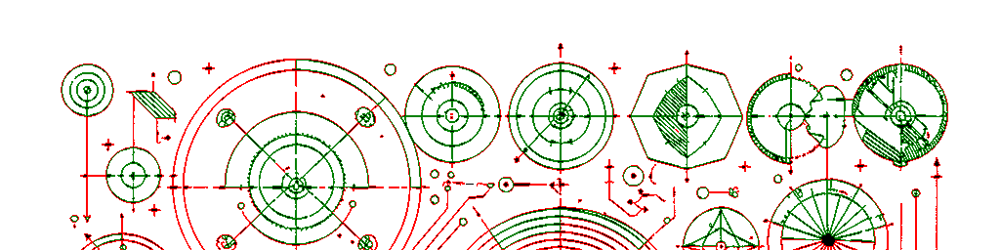
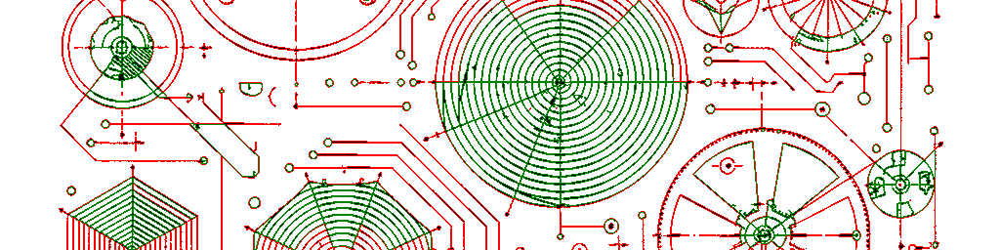
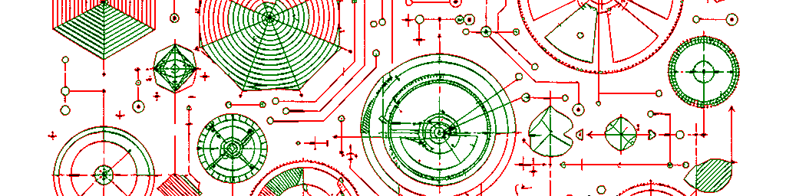
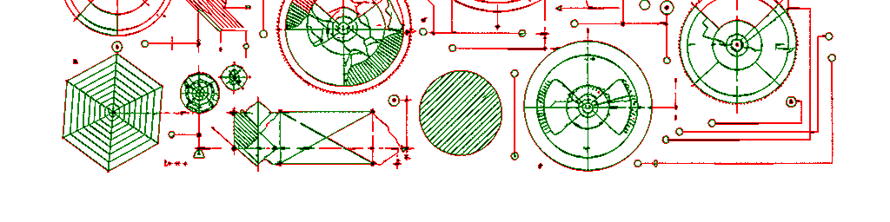
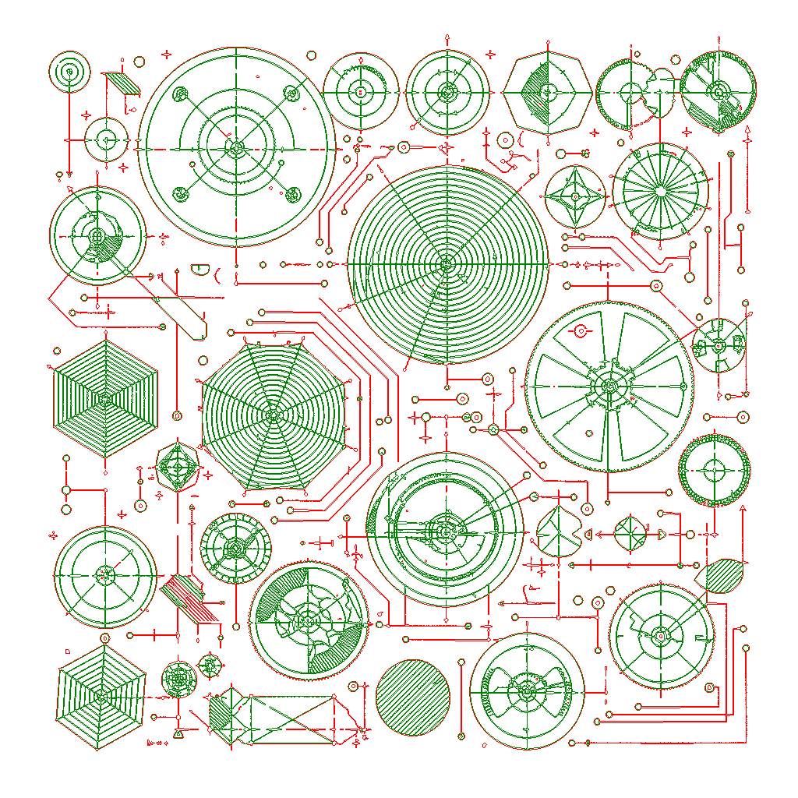

## Merging polygons

Whenever a polygon crosses the boundary between two adjacent stripes, the library reconstructs it during the merge phase.

This reconstruction preserves polygon connectivity across stripe boundaries, so the final output is equivalent to tracing the entire image in a single pass.

<table>
  <tr>
    <td width="50%" style="padding: 0; background-color: white;">
       
       
       
      
    </td>
    <td width="50%" align="center" style="vertical-align: middle; background-color: white;">
      <strong>Full Topological Reconstruction</strong>  
      
    </td>
  </tr>
  <tr>
    <td colspan="2" align="center" style="background-color: white;">
      <em><b>Left:</b> Image split into 4 independent memory buffers (stripes).</em> 
      <em><b>Right:</b> Contrek ensures <b>perfect topological continuity</b> during merging.</em> 
      🔴 <b>Red:</b> Outer contours &nbsp;&nbsp; | &nbsp;&nbsp; 🟢 <b>Green:</b> Inner zones
    </td>
  </tr>
</table>